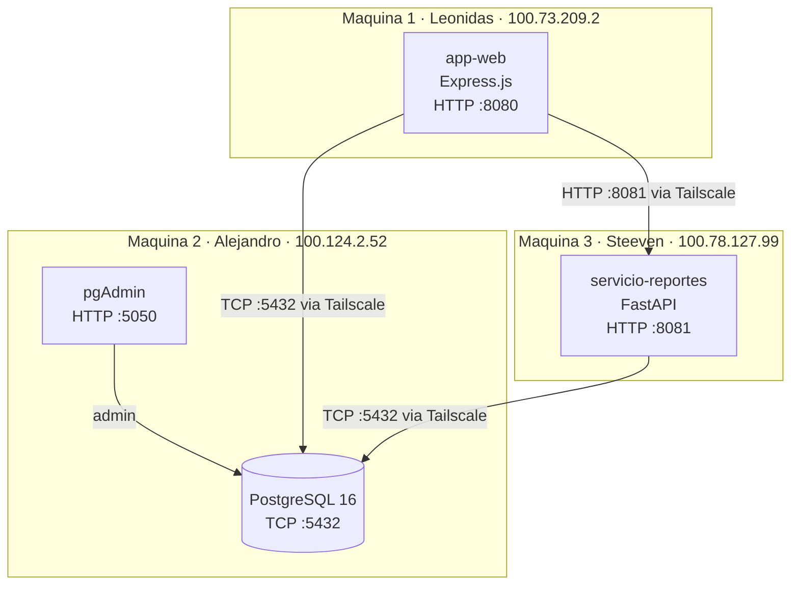
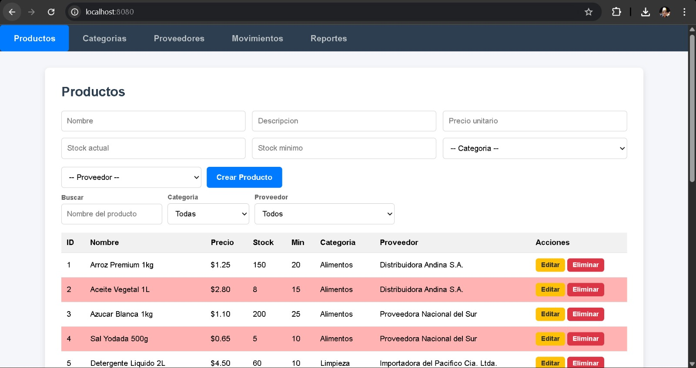
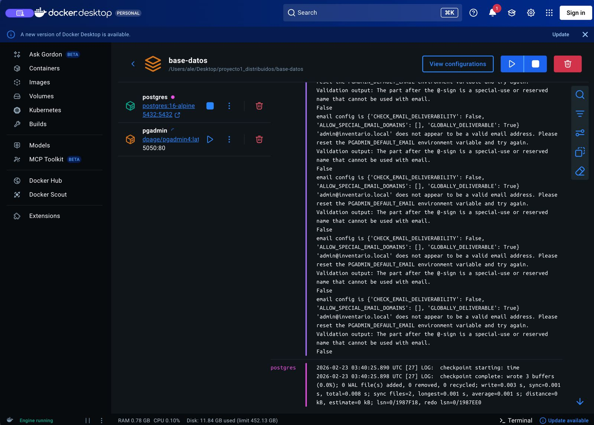
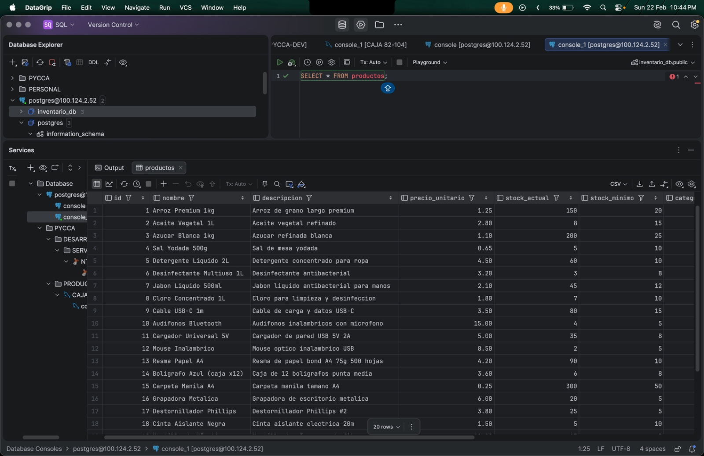
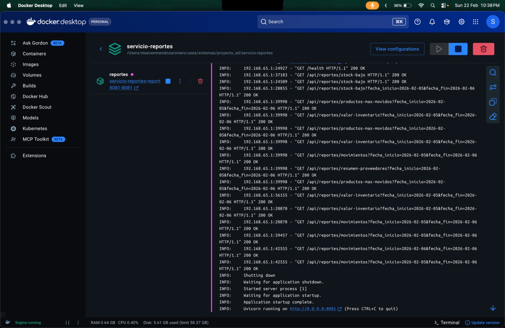
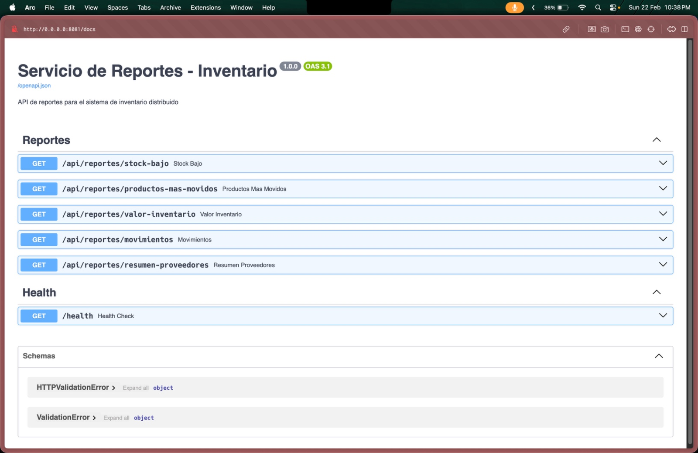
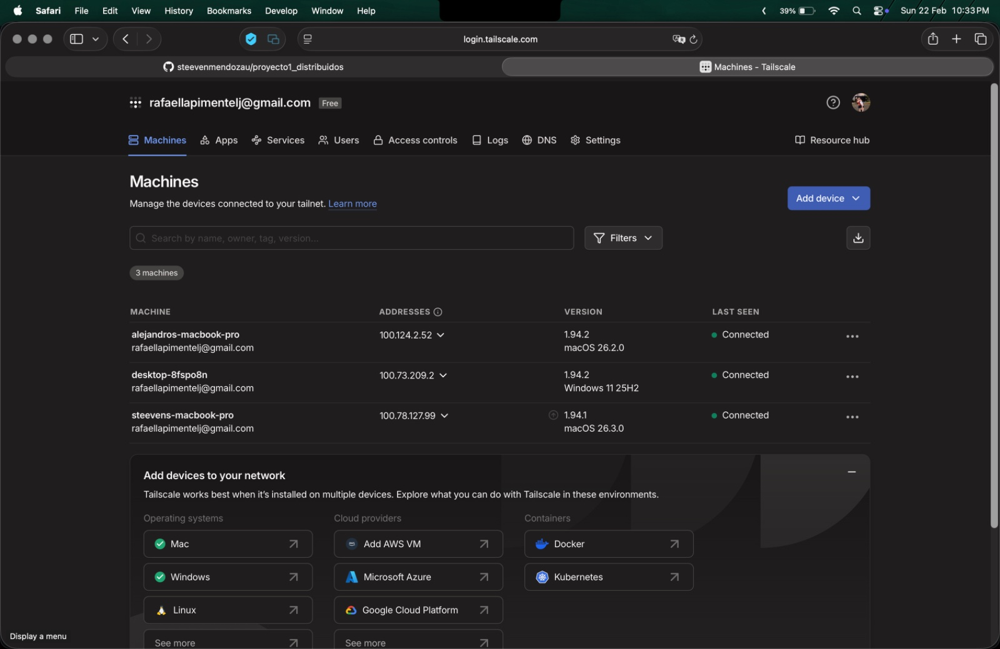
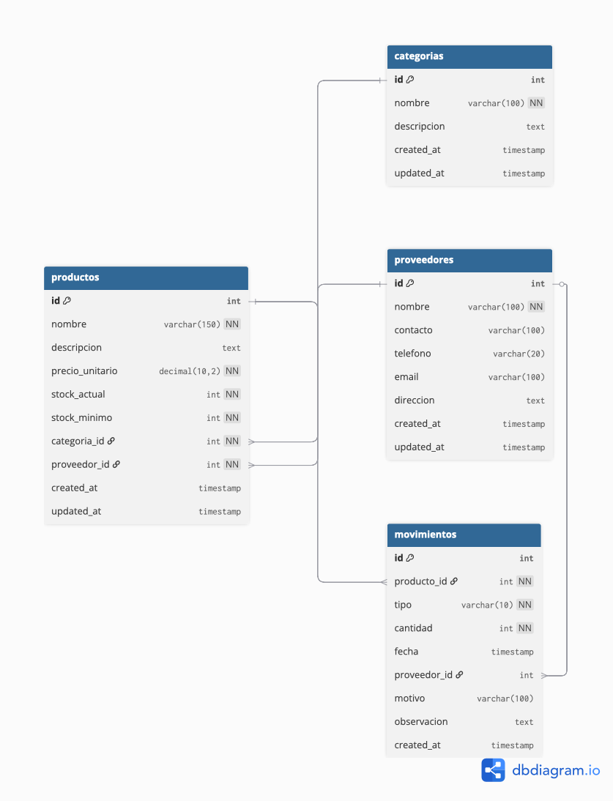

# Sistema de Inventario Distribuido

Sistema de inventario desplegado en 3 maquinas conectadas mediante Tailscale VPN, desarrollado como proyecto grupal de Sistemas Distribuidos.

## Arquitectura



| Maquina | Responsable | Servicio | IP Tailscale | Puerto |
|---------|-------------|----------|--------------|--------|
| Maquina 1 | Leonidas | Frontend + API CRUD (`app-web/`) | 100.73.209.2 | 8080 |
| Maquina 2 | Alejandro | Base de datos PostgreSQL (`base-datos/`) | 100.124.2.52 | 5432, 5050 |
| Maquina 3 | Steeven | Servicio de Reportes (`servicio-reportes/`) | 100.78.127.99 | 8081 |

## Estructura del Proyecto

```
proyecto_sd/
├── app-web/                    # Maquina 1 - Frontend + API CRUD
│   ├── docker-compose.yml
│   └── .gitignore
├── base-datos/                 # Maquina 2 - PostgreSQL + pgAdmin
│   ├── docker-compose.yml
│   ├── .env.example
│   ├── .gitignore
│   └── scripts/
│       ├── 01-ddl.sql          # Esquema de base de datos
│       └── 02-seed.sql         # Datos iniciales
└── servicio-reportes/          # Maquina 3 - API de Reportes (FastAPI)
    ├── docker-compose.yml
    ├── Dockerfile
    ├── requirements.txt
    ├── .env.example
    ├── .gitignore
    └── app/
        ├── main.py             # Aplicacion FastAPI
        ├── config.py           # Configuracion con variables de entorno
        ├── database.py         # Pool de conexiones asyncpg
        ├── models.py           # Modelos Pydantic
        ├── reports/
        │   ├── queries.py      # Consultas SQL
        │   └── router.py       # Endpoints de reportes
        └── export/
            ├── csv_export.py   # Exportacion a CSV
            └── pdf_export.py   # Exportacion a PDF
```

## Base de Datos

4 tablas principales:

- **categorias** - Categorias de productos
- **proveedores** - Proveedores del inventario
- **productos** - Productos con stock actual y minimo
- **movimientos** - Entradas y salidas de inventario

Datos seed incluidos: 5 categorias, 5 proveedores, 20 productos y 30 movimientos.

## API de Reportes

Base URL: `http://100.78.127.99:8081`

| Metodo | Ruta | Parametros | Descripcion |
|--------|------|------------|-------------|
| GET | `/health` | — | Health check |
| GET | `/api/reportes/stock-bajo` | `formato` | Productos con stock <= minimo |
| GET | `/api/reportes/productos-mas-movidos` | `fecha_inicio`, `fecha_fin`, `formato` | Top 10 productos por salidas |
| GET | `/api/reportes/valor-inventario` | `formato` | Valor total por categoria |
| GET | `/api/reportes/movimientos` | `fecha_inicio`, `fecha_fin`, `formato` | Movimientos con totales |
| GET | `/api/reportes/resumen-proveedores` | `formato` | Resumen por proveedor |

El parametro `formato` acepta: `json` (default), `pdf`, `csv`.

Documentacion interactiva disponible en: `http://100.78.127.99:8081/docs`

## Despliegue

### Requisitos

- Docker y Docker Compose instalados en las 3 maquinas
- Tailscale instalado y conectado en las 3 maquinas

### 1. Maquina 2 - Base de Datos (Alejandro)

```bash
git pull
cd base-datos
docker compose up -d
```

Verificar en pgAdmin: `http://localhost:5050`
Email: `admin@inventario.local` / Password: `admin_pgadmin_2026`

### 2. Maquina 3 - Servicio de Reportes (Steeven)

```bash
git pull
cd servicio-reportes
docker compose up --build -d
```

Verificar: `curl http://localhost:8081/health`

### 3. Maquina 1 - Frontend (Leonidas)

```bash
git pull
cd app-web
docker compose up --build -d
```

Verificar: abrir `http://localhost:8080`

## Verificacion

```bash
# Health check
curl http://100.78.127.99:8081/health

# Stock bajo
curl http://100.78.127.99:8081/api/reportes/stock-bajo

# Productos mas movidos
curl "http://100.78.127.99:8081/api/reportes/productos-mas-movidos?fecha_inicio=2026-01-01&fecha_fin=2026-02-28"

# Valor del inventario
curl http://100.78.127.99:8081/api/reportes/valor-inventario

# Movimientos
curl "http://100.78.127.99:8081/api/reportes/movimientos?fecha_inicio=2026-01-01&fecha_fin=2026-02-28"

# Resumen proveedores
curl http://100.78.127.99:8081/api/reportes/resumen-proveedores

# Exportar a PDF
curl -o reporte.pdf "http://100.78.127.99:8081/api/reportes/stock-bajo?formato=pdf"

# Exportar a CSV
curl -o reporte.csv "http://100.78.127.99:8081/api/reportes/stock-bajo?formato=csv"
```

## Tecnologias

- **Base de datos**: PostgreSQL 16, pgAdmin 4
- **Servicio de reportes**: Python 3.12, FastAPI, asyncpg, reportlab
- **Contenedores**: Docker, Docker Compose
- **Red**: Tailscale VPN

---

## Capturas del Sistema Funcionando

## App Web



## Base de Datos





## Servicio de Reportes





## Tailscale



## Diagrama ER


